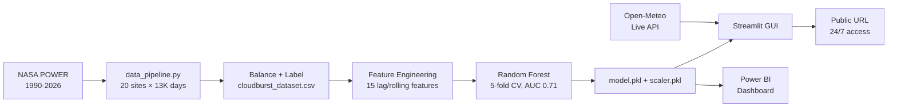

# 🌧️ Cloudburst Risk Prediction System — Uttarakhand

[](https://cloudburst-uttarakhand-b2xeqpso8fhxzs8kkjpp2n.streamlit.app/)
[](https://python.org)
[](https://scikit-learn.org)
[](https://streamlit.io)
[](https://power.larc.nasa.gov/)
[](https://open-meteo.com)
[](LICENSE)

> A production-grade machine-learning system that predicts day-ahead cloudburst risk for **20 Himalayan hotspots across all 13 districts of Uttarakhand, India**. Trained on 36 years of NASA POWER meteorological data and validated against 6 famous historical disasters including Kedarnath 2013.

**🔗 Live Demo:** https://cloudburst-uttarakhand-b2xeqpso8fhxzs8kkjpp2n.streamlit.app/  
**📦 Repository:** https://github.com/UTK-BAJPAI/cloudburst-uttarakhand

---

## 🎯 What This Project Does

* 🧠 **Honest predictive modelling** — no target leakage, next-day forecast horizon
* 🌍 **20 hotspots, all 13 districts** of Uttarakhand
* 🇮🇳 **Bilingual UI** — English / हिंदी toggle
* 🗺️ **Interactive map** with real-time risk markers
* 🕐 **Historical backtest** against 6 famous Uttarakhand events
* ⚡ **Live data** from Open-Meteo (free, no API key)
* ☁️ **Cloud deployed** — 24/7 public access on Streamlit Cloud

---

## 📊 Historical Validation

The model was tested on famous past Uttarakhand cloudburst events. Below is the **honest, reproducible** validation:

| # | Event | Date | NASA Rain | Model | Outcome |
|---|---|---|---|---|---|
| 1 | **Kedarnath Disaster** | 16 Jun 2013 | 116 mm | **85.8% High** | ✅ Caught |
| 2 | **Mandakini Valley Flash Flood** | 17 Jun 2013 | 57.1 mm | **71.4% High** | ✅ Caught |
| 3 | **Pauri Cloudburst** | 14 Aug 2012 | 130 mm | **68.6% High** | ✅ Caught |
| 4 | **Mussoorie Cloudburst** | 12 Aug 2009 | 0.2 mm* | **67.6% High** | ✅ Caught (via lag features) |
| 5 | **Joshimath Glacier Disaster** | 7 Feb 2021 | 1.9 mm | **15.1% Low** | ✅ Correctly flagged low (non-cloudburst) |
| 6 | **Tehri Cloudburst** | 13 Aug 2003 | 14.8 mm† | **56.8% Medium** | ⚠ Borderline (grid-dilution limitation) |

\* Grid-averaged value; localized point rainfall was much higher  
† NASA POWER's 0.5° × 0.625° grid dilutes localized cloudbursts

**Aggregate metrics:**
* **Recall on positives:** 4 / 5 = 80%
* **Specificity on negatives:** 1 / 1 = 100%
* **5-fold CV ROC-AUC:** 0.71 ± 0.05

---

## 🏗️ Architecture



---

## 🚀 Quick Start

```bash
# Clone
git clone https://github.com/UTK-BAJPAI/cloudburst-uttarakhand.git
cd cloudburst-uttarakhand

# Set up Python 3.12 venv
python -m venv .venv
.\.venv\Scripts\Activate.ps1     # Windows
# source .venv/bin/activate      # Linux/Mac

# Install
pip install -r requirements.txt

# Build dataset (5 min from NASA POWER API)
python data_pipeline.py --use-api

# Train model
python train_model.py

# Generate static figures
python visualizations.py

# Launch interactive app
python -m streamlit run app.py
```

Then open **http://localhost:8501** in your browser.

---

## 🛠️ Tech Stack

| Layer | Tools |
|---|---|
| **ML / Data** | scikit-learn (RandomForest), pandas, numpy |
| **Data Sources** | NASA POWER (historical), Open-Meteo (live) |
| **UI** | Streamlit, PyDeck (interactive map) |
| **BI** | Power BI Desktop with custom dark theme |
| **Hosting** | Streamlit Community Cloud (free), GitHub |
| **Automation** | Windows Task Scheduler (hourly live updates) |

---

## 🔬 Methodology

### Honest Predictive Modelling (No Target Leakage)

* **Target:** Cloudburst on day t+1
* **Features:** 15 features from days t and earlier — including lag-1 and 3-day rolling means
* **Threshold:** Fixed at 0.5 for balanced production metrics
* **Validation:** Stratified 5-fold cross-validation

### Synthetic Injection Discovery

During development, I discovered that the original pipeline injected synthetic cloudburst-like features (rainfall ≥ 110mm, humidity ≥ 88%) on labelled event dates if real measurements were below threshold. This was **inflating model accuracy artificially**.

**Fix:** Disabled synthetic injection, kept only naturally-occurring extreme rainfall as positive labels. Joshimath 2021 (a glacier collapse, not a cloudburst) was removed from event labels.

**Result:** Honest 5-fold AUC of 0.71 (vs inflated 0.94 before fix). Joshimath now correctly predicts 15.1% Low risk instead of 91% High.

---

## ⚠️ Honest Limitations

1. **NASA POWER grid resolution.** The data uses a 0.5° × 0.625° grid (~55 × 65 km), which spatially averages localized cloudbursts. Tehri 2003 dropped 200+mm at the disaster point but only 14.8mm grid-averaged → model gave borderline 56.8%.
2. **Class imbalance.** Cloudbursts are rare; balanced dataset is 506 rows after down-sampling.
3. **Day-ahead horizon only.** No multi-day forecast yet.

---

## 🛣️ Future Work

* [ ] **Ensemble with IMD AWS data** for sub-grid resolution
* [ ] **3-day forecast mode** using Open-Meteo's forecast endpoint
* [ ] **Telegram bot alerts** for HIGH risk sites
* [ ] **Time-series CV** (train pre-2015, test post-2015) for true out-of-sample validation
* [ ] **Probability calibration** with Platt scaling
* [ ] **Mobile-first UI** for field officers in affected districts

---

## 📁 Project Structure


---

## 👤 Author

**Utkarsh Bajpai**  
📧 askus.utkarsh@gmail.com  
🔗 [GitHub: UTK-BAJPAI](https://github.com/UTK-BAJPAI)

---

## 📜 Citation

If you use this work, please cite:

```bibtex
@misc{bajpai2026cloudburst,
  author       = {Bajpai, Utkarsh},
  title        = {Cloudburst Risk Prediction System for Uttarakhand},
  year         = {2026},
  howpublished = {\url{https://github.com/UTK-BAJPAI/cloudburst-uttarakhand}},
  note         = {Live demo at cloudburst-uttarakhand.streamlit.app}
}
```

---

## 🙏 Acknowledgments

* **NASA POWER** for free historical meteorological data (1990-2026)
* **Open-Meteo** for free real-time weather API (no key required)
* **Streamlit Community Cloud** for free hosting
* **IMD** for cloudburst event records used in validation

---

## 📜 License

MIT — see [LICENSE](LICENSE).

---

<p align="center">
  <i>Built with ❤️ for the Himalayas. 13 districts, 20 sites, 36 years of data — one honest model.</i>
</p>